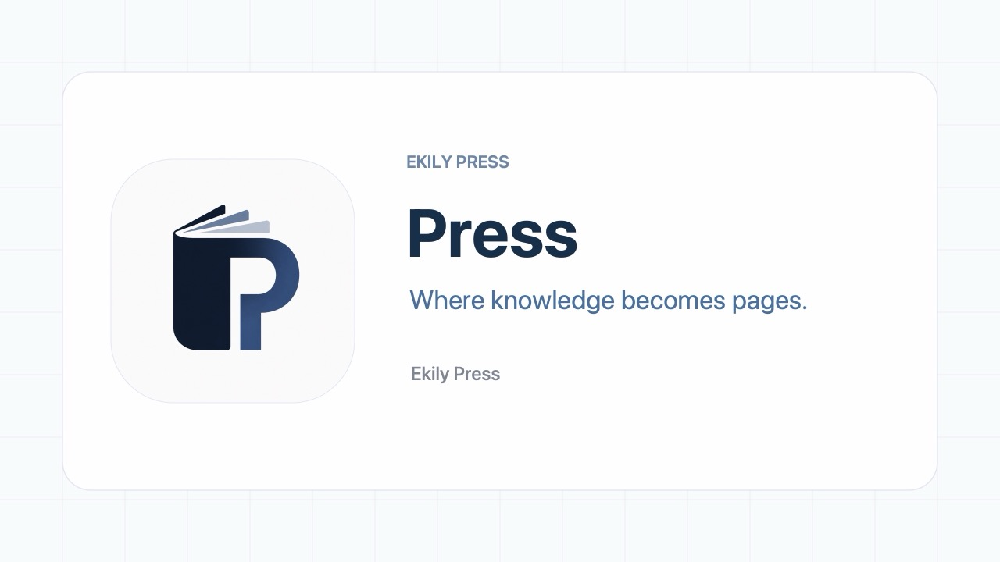

# Nanosite · ナノサイト · 微站

  <b>A zero-build, zero-config static site system powered by Markdown.</b> 
  Write Markdown → Publish instantly → Your website is live.

  
  
  
   
  
  

---

## 🚀 Introduction

**Nanosite** is a minimalist blogging & publishing system.  
No Node.js, no Python, no build process required.  
Just drop your Markdown files into the repository, and everything is rendered directly in the browser.  

Perfect for personal blogs, knowledge bases, or lightweight websites hosted on GitHub Pages.

---

## ✨ Features

- ⚡ **Zero Build** – no bundlers, compilers, or environments required.  
- 📝 **Markdown-first** – write posts like plain notes.  
- 🌐 **GitHub Pages Ready** – simply push and host.  
- 📊 **Performance Friendly** – passes [Lighthouse](https://developer.chrome.com/docs/lighthouse/overview/) audits with great scores (see hero image above).  
- 🎨 **Configurable** – customize your site using a simple `config.json`.  

---

## 🌍 Live Demo

You can see **Nanosite in action**:

- 🏠 **My Blog** (built entirely with this system):  
  👉 [dee.moe](https://dee.moe)  
  

- 📖 **Demo Website** (powered by Nanosite):  
  👉 [nano.dee.moe](https://nano.dee.moe)  
  

The demo site includes:
- An **Introduction** article: how to get started quickly.  
- A **Configuration Guide**: explaining every parameter in `config.json`.  

---

## 📦 Getting Started

Create your own site using **GitHub Template**:

1. Go to the [repository page](https://github.com/deemoe404/NanoSite).  
2. Click the green **Use this template** button in the top right.  
3. Select **Create a new repository** and name it whatever you like.  

➡️ After creating your repository, please follow the **Quick Start guide** on our documentation site:  
👉 [nano.dee.moe](https://nano.dee.moe)

---

## 📚 Documentation

Full documentation is available at:  
👉 [nano.dee.moe](https://nano.dee.moe)  

---

## 🛠 Roadmap

- [x] Theming support  
- [x] Search index  
- [x] Multi-language mode  

Contributions are welcome! Please feel free to open issues and PRs.

---

## 📜 License

MIT License © 2025 [deemoe404](https://github.com/deemoe404)  
