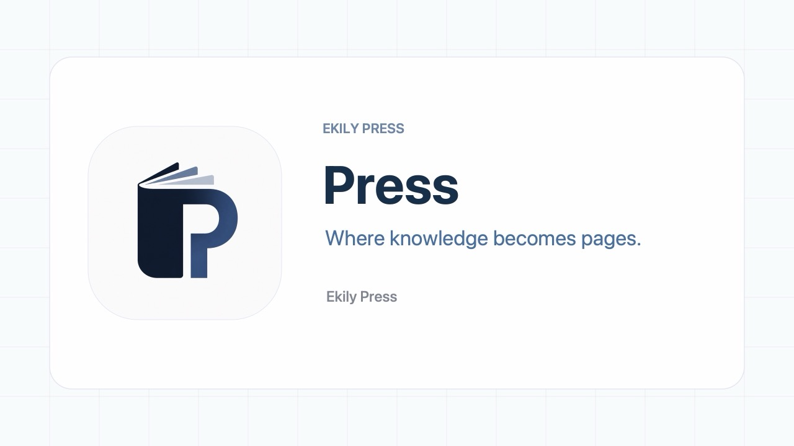

# Press



**Where knowledge becomes pages.**

This repository is the Ekily Press runtime, editor, built-in theme fallback, theme management infrastructure, official documentation site, and Markdown rendering regression corpus.

[](https://github.com/EkilyHQ/Press/stargazers)
[](https://github.com/EkilyHQ/Press/blob/main/LICENSE)
[](https://ekilyhq.github.io/Press/)

## What This Repository Is

`Press` is the main development repository for the Ekily Press runtime, editor, `native` fallback theme, Theme Manager, official documentation, and realistic Markdown content used to exercise the renderer.

Official non-native themes are developed as one repository per theme. A Press site still loads themes only from local `assets/themes/<slug>` folders; Theme Manager installs, updates, and uninstalls those folders by staging GitHub commit changes through the editor Publish flow.

The `wwwroot/` folder is intentionally not minimal. It hosts the official Press documentation, release/history pages, SEO examples, media-heavy examples, and edge-case posts that help catch regressions in Markdown parsing, front matter handling, media resolution, search, tags, SEO metadata, and theme rendering.

## For New Sites

The clean starter template lives in [EkilyHQ/Press-Starter](https://github.com/EkilyHQ/Press-Starter).

Use that starter repository when you want to create your own site. This repository is useful when you want to develop Press itself, inspect the official documentation source, or test behavior against the full documentation corpus.

The theme starter template lives in [EkilyHQ/Press-Theme-Starter](https://github.com/EkilyHQ/Press-Theme-Starter). Use it when you want to create a new Press theme repository with the release workflow and contract-compatible starter theme already wired up.

This repository carries the implementation template input for `Press-Starter` under `templates/press-starter`. The official documentation site remains the full setup guide:

- Official site: [https://ekilyhq.github.io/Press/](https://ekilyhq.github.io/Press/)
- Documentation: [Documentation for Press](https://ekilyhq.github.io/Press/?id=post%2Fdoc%2Fv2.1.0%2Fdoc_en.md&lang=en)
- Theme contract: [Press Theme Contract](https://ekilyhq.github.io/Press/?id=post%2Ftheme-contract%2Ftheme-contract_en.md&lang=en)
- GitHub Pages guide: [Configure GitHub Pages for Press](https://ekilyhq.github.io/Press/?id=post%2Fpage%2Fgithubpages_en.md&lang=en)

## Repository Layout

- `index.html` - public site entrypoint.
- `index_editor.html` - browser editor entrypoint.
- `assets/` - runtime JavaScript, i18n, schemas, the built-in `native` theme, installed theme registry, official theme catalog, and static assets.
- `assets/themes/packs.json` - site-specific installed theme registry used by Site Settings and Theme Manager.
- `assets/themes/catalog.json` - official theme catalog used by Theme Manager.
- `wwwroot/` - official documentation site content and Markdown regression corpus.
- `site.yaml` - official documentation site configuration.
- `scripts/` - repository checks and focused regression scripts.
- `templates/` - repository template input for `Press-Starter`.

## Development Workflow

Press is a zero-build static site. For local development:

```bash
python3 -m http.server 8000
```

Then open `http://localhost:8000/`.

For local-only content experiments, copy `site.local.example.yaml` to `site.local.yaml` and point it at `wwwroot.local/`. Both files are ignored by git, and the main guard prevents them from entering `main`.

Run the focused checks before merging:

```bash
bash scripts/test-main-guard.sh
bash scripts/test-frontmatter-roundtrip.sh
bash scripts/test-system-release-package.sh
bash scripts/test-system-release-workflow.sh
node --experimental-default-type=module scripts/test-system-updates.js
node --experimental-default-type=module scripts/test-theme-manager.js
node --experimental-default-type=module scripts/test-theme-contracts.js
node scripts/test-content-model.js
```

## System Releases

Merges to `main` that change Press runtime files automatically publish a patch release with a dedicated `press-system-vX.Y.Z.zip` update package. The package is intentionally limited to the application shell and runtime assets: `index.html`, `index_editor.html`, `assets/main.js`, `assets/js/`, `assets/i18n/`, `assets/schema/`, `assets/themes/native/**`, and `assets/themes/catalog.json`.

Official documentation, site content, installed theme registry state, and external theme directories stay out of system update packages. Changes that only touch `wwwroot/` do not create a system release, and update packages must never include `wwwroot/`, `site.yaml`, `CNAME`, `robots.txt`, `sitemap.xml`, repository policy files, workflow files, scripts, site-specific media such as `assets/avatar.png` and `assets/hero.jpeg`, `assets/themes/packs.json`, or arbitrary `assets/themes/<slug>` directories outside `native`.

After a system release is published, the release workflow can dispatch `EkilyHQ/Press-Starter` to rebuild the template from that release package. Configure `STARTER_SYNC_TOKEN` in this repository with permission to call repository dispatch on the starter repository. `STARTER_REPOSITORY` can be set as a repository variable when the starter repository name differs from `EkilyHQ/Press-Starter`.

## Branching

The long-lived `doc` branch is retired. `main` is now the stable source for the runtime and the official documentation site.

Use short-lived `feat/*` or `codex/*` branches for work, then merge them into `main` after review and verification. See [BRANCHING.md](BRANCHING.md) for the full policy.

## Built With Press

- [Press official documentation](https://ekilyhq.github.io/Press/) - the documentation site hosted from this repository.

Want to list your site here? Open a PR with the site URL and a one-line description.

## Theme Repositories

Official themes use separate repositories such as `EkilyHQ/Press-Theme-Arcus`. New theme repositories should start from [EkilyHQ/Press-Theme-Starter](https://github.com/EkilyHQ/Press-Theme-Starter). Each theme repository owns its theme source, contract checks, release workflow, `press-theme-<slug>-vX.Y.Z.zip` artifact, SHA-256 digest, and root `theme-release.json` manifest. Press owns only the runtime infrastructure, `native`, and `catalog.json`; each site owns its installed `packs.json`.

## Roadmap

- Add LaTeX support.
- Implement comments backed by GitHub Discussions.

## License

MIT License © 2025 [Ekily](https://github.com/EkilyHQ)
