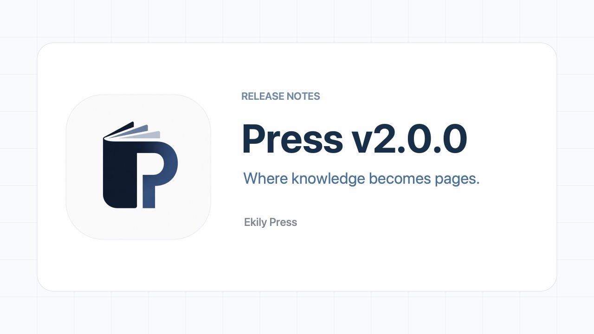

源代码: [GitHub 上的 Press](https://github.com/EkilyHQ/Press)

## 亮点

- 使用 **Markdown** 编写
- 支持在 **GitHub Pages** 上运行（免费托管）
- 搜索、标签、阅读时长、深色模式与主题包
- 可选的标签页（About、Projects 等）
- 可选的多语言界面与文章
- 自动生成目录，支持可复制的锚点
- 内置分页，适用于大型索引与搜索

## 快速上手

1) 等精简模板仓库发布后，从 [Press-Starter](https://github.com/EkilyHQ/Press-Starter) 创建你自己的站点仓库。
2) 为新仓库命名。
3) 将新仓库下载到本地
  - 方式一：使用 Git 克隆仓库
  - 方式二：下载 ZIP 文件
    - 点击绿色 **Code** 按钮，然后选择 **Download ZIP**。
  - 方式三：使用 GitHub Desktop
    - 如果已安装 GitHub Desktop，可在网页上选择 "Open with GitHub Desktop"。
4) 本地预览（推荐）
  - 在项目目录启动一个简单的服务器：
    - macOS/Linux: `python3 -m http.server 8000`
    - Windows（PowerShell）: `py -m http.server 8000`
  - 在浏览器打开 `http://localhost:8000/`。
5) 设置站点名称与链接
    - 打开项目根目录的 `site.yaml`，编辑基础设置：
  ```yaml
  siteTitle: "My Site"
  siteSubtitle: "Welcome!"
  avatar: assets/avatar.png
  profileLinks:
    - label: GitHub
      href: https://github.com/your-username
    - label: Twitter
      href: https://twitter.com/your-username
    - label: LinkedIn
      href: https://www.linkedin.com/in/your-profile
  ```
6) 开始写作！
  - 在 `wwwroot/` 下新建一个 Markdown 文件，例如 `wwwroot/my-first-post.md`：
  ```markdown
  ---
  title: 我的第一篇文章
  date: 2025-08-17
  tags:
    - 笔记
    - 技术
  ---

  # 我的第一篇文章

  你好！这是我的第一篇文章。我可以编写文本、列表，并添加图片。
  ```
  - 在 `wwwroot/index.yaml` 中注册它，使其显示在首页：
  ```yaml
  我的第一篇文章:
    chs: my-first-post.md
  xxxx:
    chs: xxxx.md
  ```

🎉 恭喜！你已经完成Press的设置。刷新页面，你应该能在首页看到你的文章卡片，点击即可阅读。

## 接下来做什么？

- 更多自定义选项：查看[文档](?id=post/doc/v2.1.0/doc_chs.md)。
- 部署到 GitHub Pages：查看[部署指南](?id=post/page/githubpages_chs.md)。
- 搜索引擎优化（SEO）：查看[SEO 优化](?id=post/seo/seo_chs.md)。
