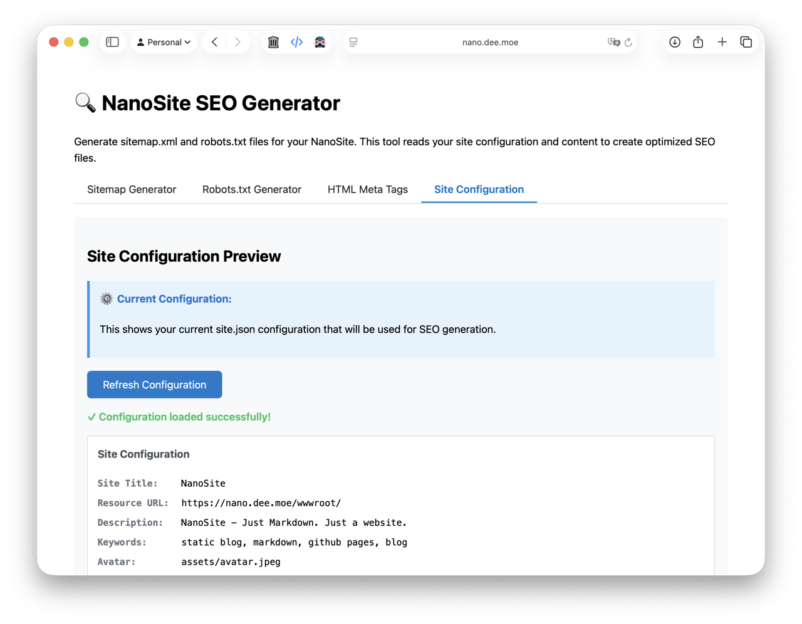
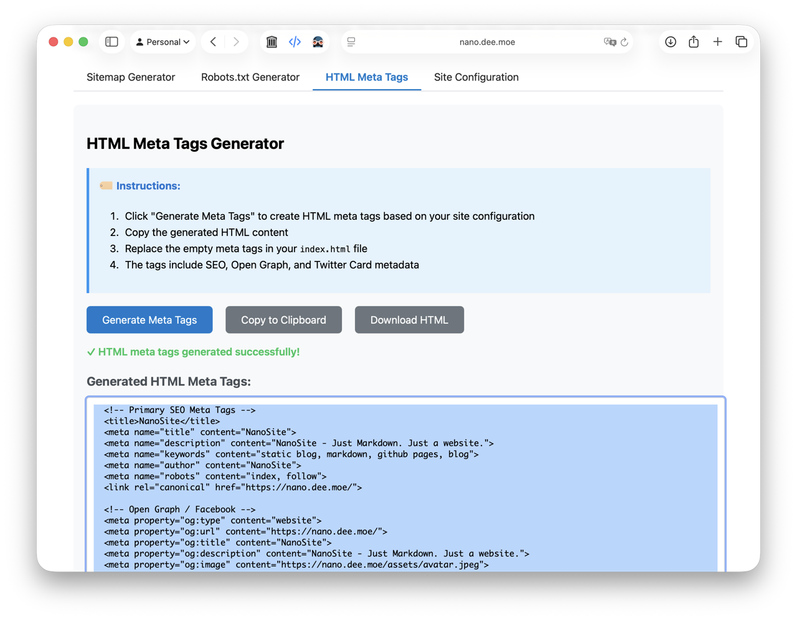

## 動的 SEO

NanoSite には SEO タグ生成機能が内蔵されており、ページ内容に基づいて自動的に meta タグを生成します。含まれるもの：

- タイトルとディスクリプション
- SNS 共有向けの Open Graph タグ
- Twitter Card タグ

`site.yaml` に追加情報を記述することで、生成されるタグをカスタマイズできます。

## 静的 SEO

JavaScript 依存度の高いサイトは、クローラが適切にクロールできない場合があります。正しくインデックスされるよう、次の手順で静的リソースを用意してください。

1) サイトの `/index_seo.html` をブラウザで開きます（本番サーバーまたは GitHub Pages にデプロイしてから実行してください）。

2) 「サイト設定」セクションで各項目が正しく入力されているか確認します。不足があれば `site.yaml` を編集して再確認してください。

3) 「サイトマップ生成」セクションで「Generate Sitemap」をクリックし、必要なファイルを生成します。ダウンロードするか、生成コードを自分のファイルにコピーできます。

4) 「Robots.txt 生成」セクションで「Generate Robots.txt」をクリックし、必要なファイルを生成します。ダウンロードするか、生成コードをコピーしてください。

5) 「HTML Meta タグ」セクションで「Generate HTML Meta Tags」をクリックし、サイト用の4つのタグ群を生成します。対応する HTML の位置に配置してください。

