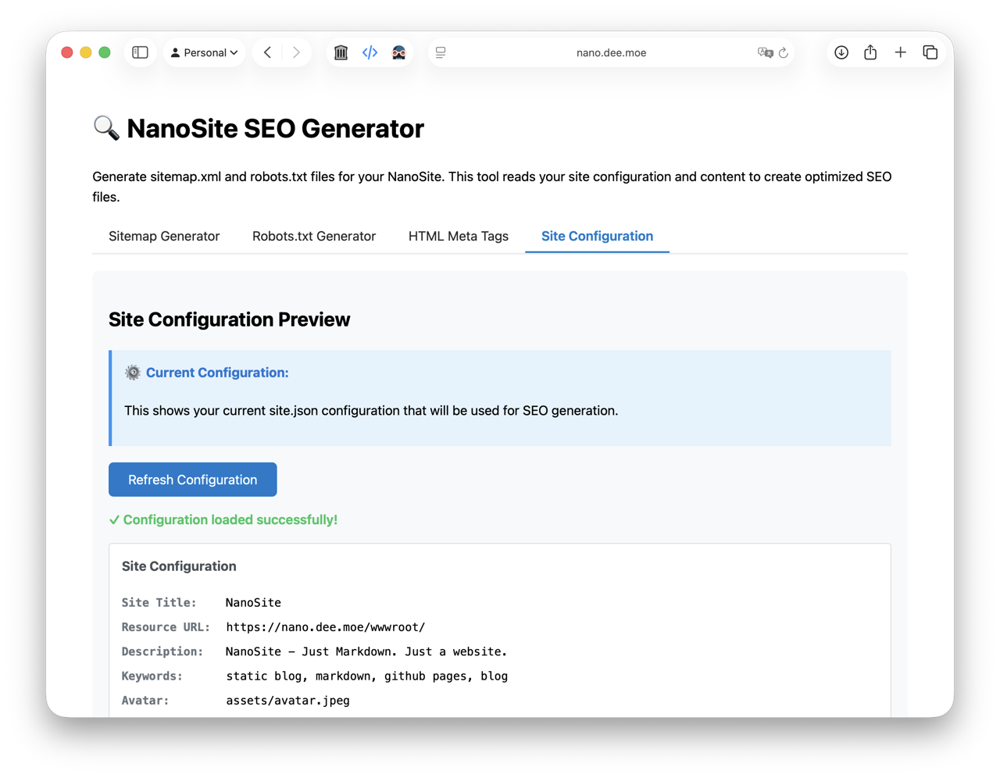
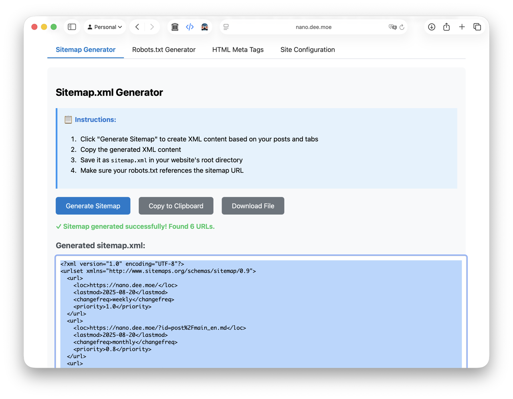
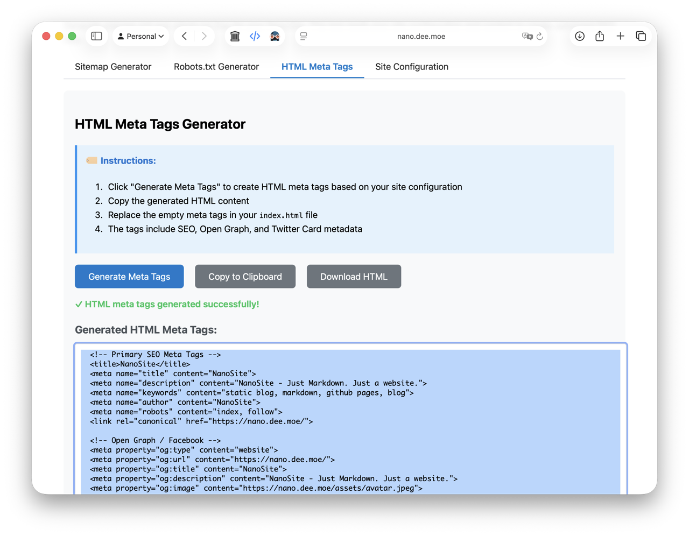

## 动态 SEO

NanoSite 内置 SEO 标签生成器，会根据页面内容自动生成常用的 meta 标签，包括：

- 标题与描述（title/description）
- 用于社交媒体分享的 Open Graph 标签
- Twitter Card 标签

你可以在 `site.yaml` 中补充更多站点信息，以便进一步定制生成的标签。

## 静态 SEO

部分搜索引擎爬虫在抓取重度 JavaScript 的站点时可能存在困难。为确保内容被正确收录，建议按以下步骤生成静态资源：

1) 在浏览器中打开你网站的 `/index_seo.html`（请先将 NanoSite 部署到生产环境或 GitHub Pages）。

2) 前往「站点配置」区域，确保所有字段填写正确；若不完整，请编辑 `site.yaml` 后重试。

3) 进入「Sitemap 生成器」区域，点击「生成 Sitemap」以创建相关文件。你可以选择下载，或将生成的代码复制到你的文件中。

4) 进入「Robots.txt 生成器」区域，点击「生成 Robots.txt」以创建相关文件。你可以选择下载，或将生成的代码复制到你的文件中。

5) 进入「HTML Meta 标签」区域，点击「生成 HTML Meta 标签」，为站点生成四组常用 meta 标签。将它们放入对应的 HTML 位置。

