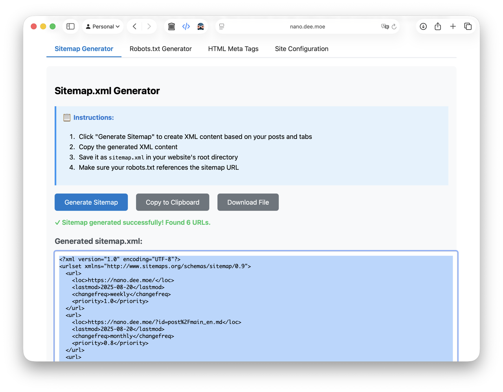

## Dynamic SEO

NanoSite comes with built-in SEO tags generator that automatically creates meta tags for your pages based on their content. This includes:

- Title and description tags
- Open Graph tags for social media
- Twitter Card tags

You can customize the generated tags by providing additional information in the `site.json` file.

## Static SEO

Sometimes spiders have difficulty crawling JavaScript-heavy sites. To ensure your content is indexed properly, consider the following:

1) Open `/index_seo.html` of you website in your browser, remember to host the NanoSite using production server or GitHub Pages first.

2) Navigate to the "Site Configuration" section and ensure all fields are filled out correctly. If not, edit information in the `site.json` file and try again.

3) Navigate to "Sitemap Generator" sections, click "Generate Sitemap" to create the necessary files. You can either download them or copy the generated code into your own files.

4) Navigate to "Robots.txt Generator" section, click "Generate Robots.txt" to create the necessary files. You can either download them or copy the generated code into your own files.

5) Navigate to "HTML Meta Tags" section, click "Generate HTML Meta Tags" to create 4 clusters of meta tags for your site. Place them in the corresponding sections of your HTML files.

