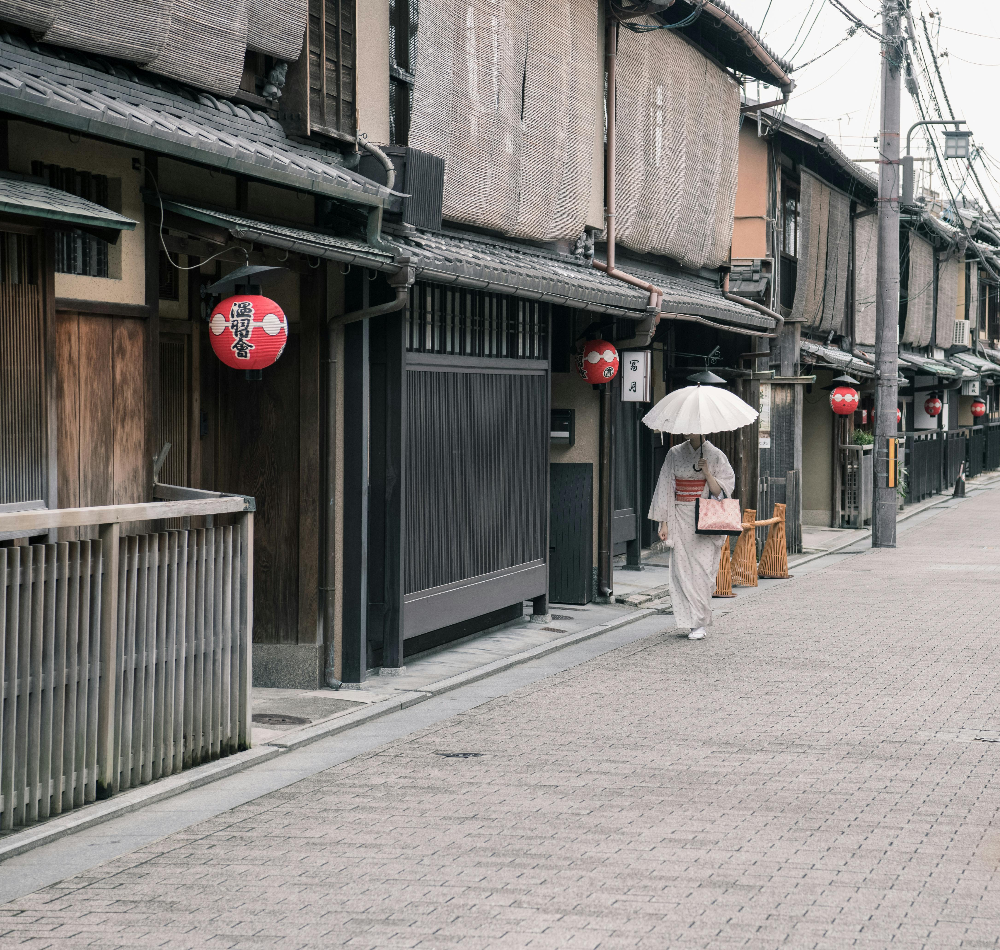

# Trip Log 01 — Kyoto

Date: 2024-02-03

Landed in Kyoto just before sunset. Walked through Gion’s narrow alleys, then up to Kiyomizu-dera for a city view washed in gold. Warm bowl of ramen, colder wind by the river. Not a bad start.

## Notes

- Steps: 16,842
- Weather: clear, 6–11°C
- Find: a tiny tea shop that roasts on site
